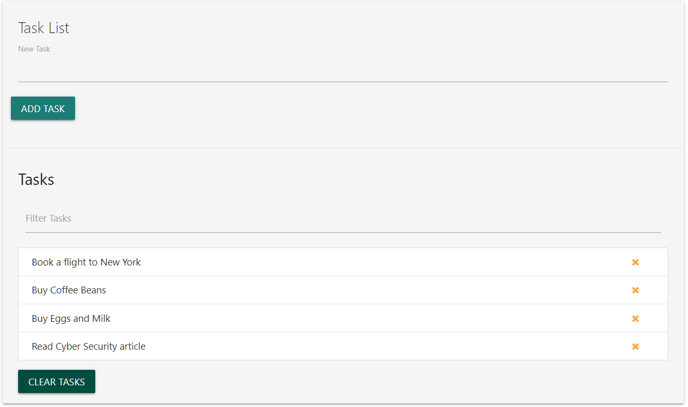

This small TaskList app is built with Vanilla_JavaScript. UI of this app is done with Materializecss. For the icons, Fontawesome has been used.
This app have delete and filter functionality. Data will also be persisted to local storage. 
The purpose of this app was to learn the manipulation of DOM using the Vanilla_Javascript. 

To run the project, Download or clone it on your machine and open index.html on your browser.

